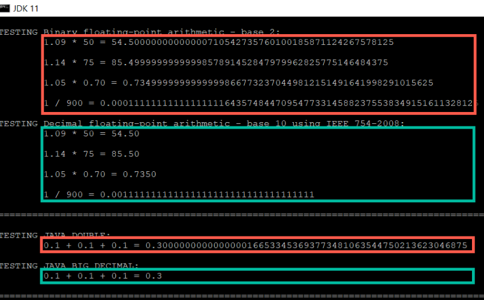

# Example of Decimal Floating Point usage

## Overview

In the context of standardization of CEN TC 434 WG1 (European e-invoicing) a problem occurred that invoices differ in some values significantly although provided by the same data input.
The suggested solution was threefold:

1. Define the [way of rounding](https://docs.oracle.com/en/java/javase/11/docs/api/java.base/java/math/RoundingMode.html) to be used. For instance, [German law](src/test/resources/tax-law.md) requires to use [HALF-UP rounding](https://docs.oracle.com/en/java/javase/11/docs/api/java.base/java/math/RoundingMode.html#HALF_UP) for VAT calculation.

2. Define only ways to calculate an invoice value, which lead to the same results. The gross total can be calculated by:
    1. Adding all net values of each invoice line and multiply the sum with the VAT tax.
    2. Multiply the VAT tax to each invoice line net value and add the gross line amounts. 
    The latter way includes rounding of intermediate results, which leads further away from the arithmetic truth and should be avoided.

3. Define a way to do accurate arithmetic calculation by expressing that the implementation have to be as accurate as if been using decimal-based floating-point arithmetic.
First standardized in 1987 by IEEE 854, integrated with IEEE 754 in 2008, latest IEEE 754:2019 and also available as [ISO standard](https://www.iso.org/standard/80985.html).

My kind regards to the former IEEE 754 chair, David Hough, and editor, [Mike Cowlishaw](https://en.wikipedia.org/wiki/Mike_Cowlishaw), who took the time to answer to my questions and provide guidance.
Mike is maintaining [a very good FAQ on Decimal based floating point](http://speleotrove.com/decimal/decifaq.html).

## Show & Tell

The example is based on work from the [Princeton University](https://introcs.cs.princeton.edu/java/91float/Financial.java.html).

The green boxes are using decimal based floating point and the red boxes binary based floating point.

**NOTE:** Most evident the last box, where adding three times 0,1 is not exactly 0,3.

## Run the example

Call from a command-line in the root directory of the repository: "gradlew clean build"

## Precision vs. accuracy

* Precision = tightness of specification
* Accuracy = correctness
As explained in [https://introcs.cs.princeton.edu/java/91float/](https://introcs.cs.princeton.edu/java/91float/).
